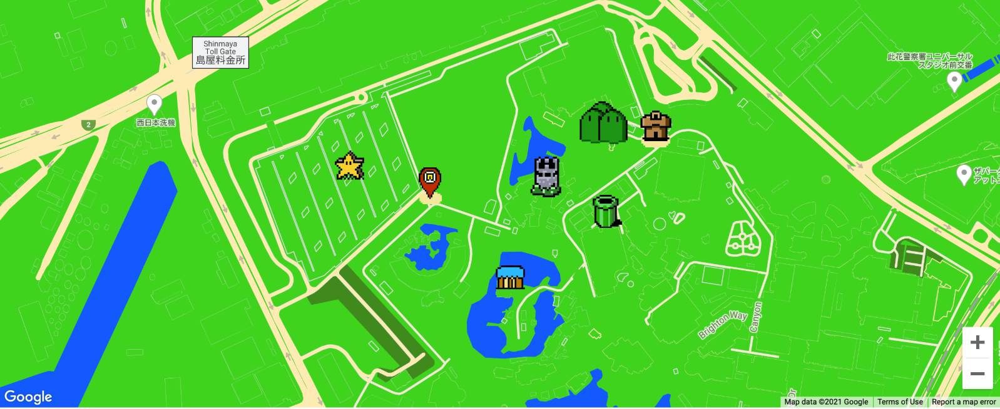

# Building a Super Mario themed Google map!

## Description

This project demonstrates a custom styled Google map using the Google Cloud Platform and the Google Maps JavaScript API.

- create a Google Cloud Platform project
- style your map in Google Map Management
- use the map ID and API key to load the map on your website with the Google Maps JavaScript API
- use CSS to display and style the map on the website
- jse the JavaScript API to customize the map settings like center point and zoom
- create and place custom map markers

## Table of Contents (Optional)

- [Usage](#usage)
- [Badges](#badges)
- [How_to_Contribute](#how_to_contribute)
- [Credits](#credits)
- [License](#license)

## Usage

https://arishorts.github.io/supermario_google_map_api/
Click the markers for detailed location description.

## Badges

## How_to_Contribute

If you would like to contribute, refer to the [Contributor Covenant](https://www.contributor-covenant.org/)

## Credits

- Google API Overview: https://developers.google.com/maps/documentation/javascript/overlays
- Jessica Chan: Check out the [full project](https://www.codementor.io/projects/build-a-custom-google-maps-theme-bf8levr6eg) on DevProjects by Codementor.
- Youtube Jessica @ https://www.youtube.com/watch?v=CdDXbvBFXLY

## License

MIT License https://choosealicense.com/licenses/mit/

---

© 2022 Ariel Schwartz LLC. Confidential and Proprietary. All Rights Reserved.
